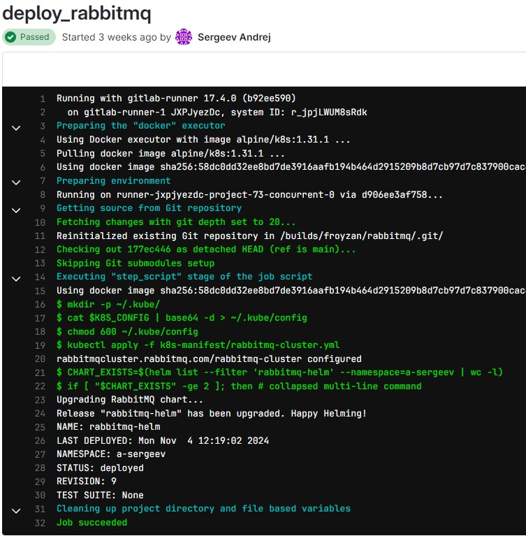
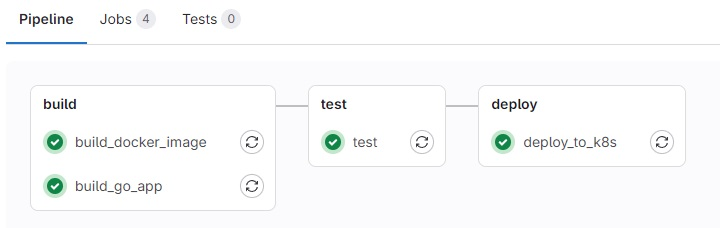

# Gitlab CI Pipelines

# PIG - a dummy app

### Build/Test/Run

To build project hit:

`go build`

To run tests hit:

`go test ./...`

To run the app hit:

`go run main.go`

or run compiled binary

`./pig`

### Notes

Be also aware of ./resources directory which contains index HTML page. This should be copied alongside with ./pig binary as well with the same structure

